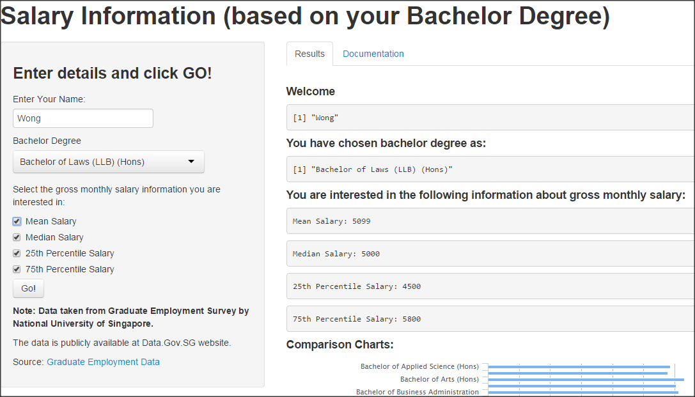
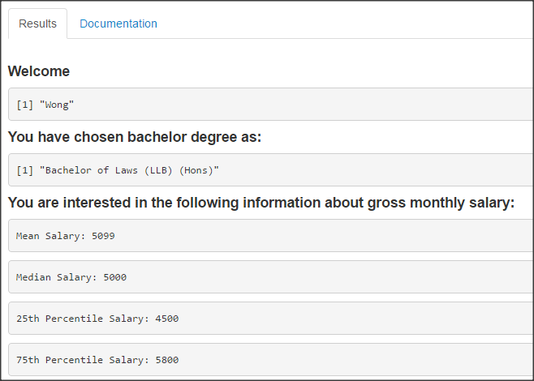
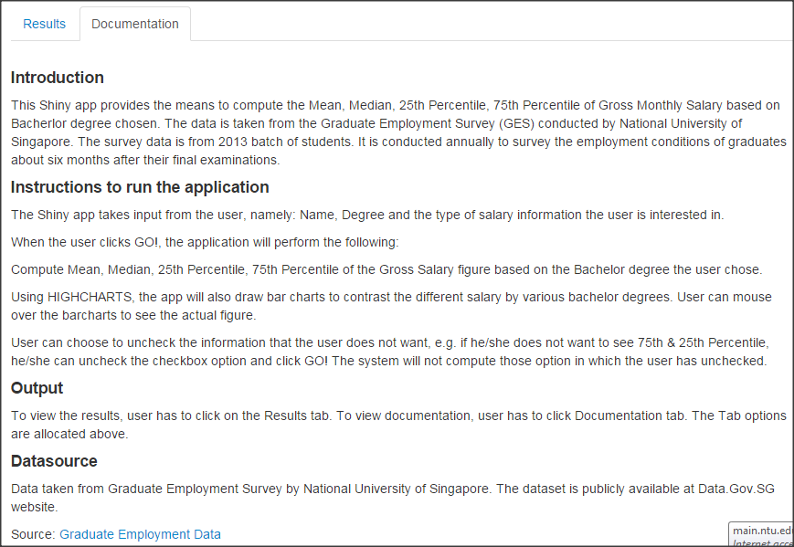

Salary Information App
=============================
author: Jacky Wong Kae Perng
date: January 22 2015
transition: rotate

This Shiny app provides the means to compute the Mean, Median, 25th Percentile, 75th Percentile of Gross Monthly Salary based on Bachelor degree chosen by the user. 

The data is taken from the Graduate Employment Survey (GES) conducted by National University of Singapore. The dataset is publicly available at Data.Gov.SG website.

[App Location](https://wongkaeperng.shinyapps.io/salary2/) |
[GitHub](https://github.com/wongkaeperng) |
[RPubs](http://rpubs.com/wongkaeperng/54928) |
[Data Source](http://data.gov.sg/Metadata/SGMatadata.aspx?id=0319010000000013941E&mid=113198&t=TEXTUAL)

What problem is this app trying to solve?
=========================================
transition: rotate
- A graduate job seeker can make sense of the salary data by querying the  Mean, Median, 25th Percentile, 75th Percentile of Gross Monthly Salary based on the selected Bachelor degree. This provides critical information when it comes to negotiating for salary package in job market.
- Potential student who is considering which bachelor degree to choose can use this application to not only make sense of salary information based on degree but also compare the expected renumeration of each degree using the charts comparison feature.
- Recruiter/employer can use this tool to judge the competitiveness of their renumeration package offered to potential hires.

User Interface
==============
transition: rotate
Screenshot of the app:

User will enter:
- Name
- Select the degree
- Select what salary information to compute and click GO!

***

Shiny App will:
- Display name entered
- Display degree selected
- Compute the selected salary information based on degree chosen.
- Provide a comparison charts for the salary information of all degrees. 
- User can mouse over the bar charts to see the actual salary figure.

Compare salary chart
====================
Below is a sample output of the chart produced. User can mouse over (try now) the bar charts to see the actual salary figure for each degree. Note: R Codes embeded in this slide, set to echo=False.

 
 

Result & Documentation Tab
==========================
In addition to chart, the result will be displayed as follow:

If you have further feedback, please contact me at wongkaeperng@hotmail.com 
***
User can also click on the documentation tab to see the documentation:

Thank you. And hope you find the apps useful! :)

